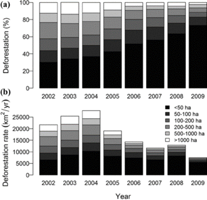

```{r setup, include=FALSE}
knitr::opts_chunk$set(echo = F, include = T, message = F, warning = F, fig.align = "center", out.width = '100%')
```


### 1. Introduction

 Following [Rosa et al. (2012)](https://doi.org/10.1111/j.1523-1739.2012.01901.x) and [Assunção et al. (2017)](https://doi.org/10.1016/j.landusepol.2017.04.022), I am going to analyze how the deforestation pattern changed from 2002 through 2014 in the Legal Amazon. I will focus on three main elements: the trends of the deforestation by polygon size, the heterogeneity across state patterns, and the spatial distribution of the polygons over time. In 2004, the Brazilian Government implemented a satellite-based system that provides near-real-time alerts of deforestation (DETER) to inform law enforcement operations against illegal deforestation of tropical forest in the Amazon. However, this system can only detect clearings of a contiguous area bigger than 25 ha, so patches below this threshold are invisible to DETER and this information is public. Thus, the hypothesis is that DETER created an incentive to deforesters strategically adapt their behavior to deforest in small patches and thus impacted the distribution of the polygons size. Also, in 2008, there was a second turning point on conservation policies with the creation of a blacklist that allowed law enforcement to better target their efforts on municipalities with high rates of recent deforestation. Identifying a causal relationship between these policies changes and the deforestation trends is out of the scope of this report, what we are aiming to show here is a descriptive analysis of the deforestation pattern, considering time, state, and cleared patch size variation.


### 2. Data

We will use the following spatial data (shapefiles):

#### 2.1. [Annual Deforestation Polygons [2002-2014]](http://www.dpi.inpe.br/prodesdigital/dadosn/2014)**

It contains the annual deforestation series of the Brazilian Amazon. Multiple shapefiles, one for each Landsat mosaic scene.

We use the 2014 file because we can recover all the previous year information from this mask.
The shapefiles contains polygons of other land cover categories besides deforestation  that won't be used in this analysis, like forest and hydrography.

CRS: LongLat (coordinate system), SAD69_pre96_BRonly (datum), not projected 


#### 2.2. [Legal Amazon and State Boundaries](http://www.dpi.inpe.br/amb_data/Shapefiles/UF_AmLeg_LLwgs84.zip)** 

Shapefile with the Legal Amazon Limits and the State Boundaries. Legal Amazon is geopoltical division of Brazil, includes the whole Brazilian Amazon Biome, part of the Cerrado and the Pantanal. More info about it: (https://en.wikipedia.org/wiki/Legal_Amazon)

CRS: LongLat (coordinate system), WGS84 (datum), not projected 

### 3. Objectives

We divided this project into three main parts:

#### 3.1. An overall analysis of the deforestation trends by polygon size in the Legal Amazon. 

#### 3.2. Analyze state heterogeneities, looking at deforestation trends by polygon size, maps showing the evolution of the relevance of small polygons to the total deforestation and the share of the state deforested area.

#### 3.3. Analyze the spatial distribution of the deforestation polygons by size in three distinct time periods, when deforestation was increasing, decreasing and fin stable.


### 4. Deforestation Trends by size of cleared patch 

First of all, we are going to explore the evolution of the deforestation across the period of interest (2002-2014), splitting the deforestation increment into two categories: small polygons (contiguous area smaller than 25 hectars) and large polygons (contiguous area greater than 25 hectars). This analysis is inspired by: 

```{r , fig.cap = "Amazon deforestation by the size of cleared forest patch, 2002–2012 - (Assunção et al., 2017)", out.width = '100%'}
knitr::include_graphics("../images/deforestation_increment_sizes.png") # since this points to the figures generated by the final-project.Rmd >
# changes on that file that modify this figure will be automatically reproduced here
```

```{r }

```

As we can see in both graphs above, there war sharp falls in the deforestation after both anti-deforestation policies turning points (2004 and 2008), however as pointed out by Assunção et al. (2017) it seems to have impacted more the large polygons, increasing the relevance of small polygons. Linking this descriptive evidence with the fact that the satellite-based monitoring system can only detect the large cleared patches and that this limitation was public information, there might be a strategic behavior adaptation by deforesters explaining it. Our plot is a reproduction of Assunção et al. (2017) graph, but expanding to include two more years. This inclusion doesn't change the overall interpretation, only shows that the levels are somewhat constant, with a small increase similar for both groups.

For completeness we also reproduce:

```{r , fig.cap="(a) Percentage and (b) area of deforested patches of different sizes in the Brazilian Amazon from 2002 through 2009. - (Rosa et al., 2012)"}

```


\newpage

```{r }
knitr::include_graphics("final-project_files/figure-markdown_github/def_trends_polyg_size_2-1.png")
```


These plots allows us to explore the trends for more categories and also look at the shares and not only the nominal increment. In our reproduction we expand it to include 5 more years and use the size intervals based on Assunção et al. (2017) to separate the policy relevant category of (<25ha). Looking at the shares we can see a sistematic increase in the share of small polygons (<25 ha) until 2010, after that there is a decrease but remaining as the majority proportion. The share is calculated as the ratio of the  deforestation generated by the polygon size category and the total deforestation, for each year.


### 5. State Heterogeneity  

Secondly, we want to explore the variation of these trends acrosse the states, to check for the presence of outliers and heterogeneity. As argued by Assunção et al. (2017), regional heterogeneities require the policies to be tailored to maximize its efficiency. Inspired by: 


```{r ,fig.pos = "h!", fig.cap = "Deforestation inside registered properties by property and cleared patch size, 2002–2012. - (Assunção et al., 2017))", out.width = '100%'}
knitr::include_graphics("../images/deforestation_percentage_byState_byYear_bySize.png")
```

In this case, we cannot reproduce the content of Fig. 3 entirely because we do not have assess to registered properties information, on the other hand, we expand their analysis to cover all the Legal Amazon States instead of only two. In practice, we cannot link the polygon size with the type of agent (small, medium or large properties) but we can have a better notion of the heterogeneity of the deforestation by size. 


For starters we do a exploratory plot, to show the Legal Amazon region and its states.
```{r }

```

For a complete notion of what's happening in each state we plot the proportion of the 4 sizes categories for each year.

```{r out.width='100%'}

```

We see that there are states such as AC and AP with almost all the deforestation coming from small polygons, contrasting with states like MT were larger polygons are more relevant. As expected for most of the states, small polygons increased their relevance becoming the majority, yet the presence of other patterns supports the idea of tailored policy to adjust the polcies accordingly to the local pattern instead of treating the whole region as unique and uniform. 


To complement the last plot we also focus only on the share of small polygons and the share of the State Deforested area to have a better visualization of the state-differences in each year.
```{r }
knitr::include_graphics("final-project_files/figure-markdown_github/la_states_polyg_prop_2-1.png")
```

```{r }

```

From these visualizations we can conclude that there are persistent differences across the states for any given year for both measures, even though there is a common trends of less total deforestation and more presence of small cleared patches.


### 6. Spatial Distribution of deforestation by cleared patch size across time (2002-2014) - create function to just change the start and end year

Finally, we want to take advantage that we have spatial data at the polygon level to observe the spatial distribution of the deforestation by polygon size in different time periods, first a period of fast increase in deforestation rate (2002-2004), then a period of fast decrease (2005-2009) and lastly a period of relative stabilization (2010-2014). Inspired by:

```{r , fig.cap="Distribution of deforested patches of different sizes in the Brazilian Amazon for periods of (a) rapidly increasing deforestation (2002 through 2004) and (b) rapidly decreasing deforestation (2005 through 2009).- (Rosa et al., 2012)", fig.pos = 'h!'}
knitr::include_graphics("../images/deforestation_map_bySize_rosa_et_al_2012.png")
```


```{r}

```

Looking at these three plots we can clearly identify the spatial persistence of the deforestation althoug it is becoming less dense. Also, small polygons, as expected in these type of map seems to be even more relevant because all the deforestation areas look like points at this scale. Moreover, we can identify some areas with intense deofrestation in their borders but much less inside it, some of these are the protected areas (indigenous lands, national parks, areas for sustainable use, are for strict protection) created by the government to block deforestation advances.


### 7. Conclusion

Summarizing, this report shows a descriptive analysis of the recent deforestation in the Legal Amazon, focusing on clearing patches heterogeneities, differences across states and the spatial distribution of the deforestation. We followed the work of Assunção et al. (2017) and Rosa et al. (2012), relating the descriptive analysis with possible policy implications. We replicate some of the findings of these studies, expanding their analysis to include more years (2002-2014) and mixing complementary elements from both of the. In general, we find that the deforestation rates had a sharp fall after 2004 and 2008 and then stabilized in more recent years. Also, the decrease was bigger for large polygons (above 25 hectars) than small polygons, we associate this difference due to the implementation of the DETER system that can only detect large polygons. This could indicate a strategic change of behavior from the deforesters, but establishing this causal link is out of the scope of this research. For the secon part, we explored state heterogeneity and find that there is a considerable variation that should be taken into acoount by policymakers. Lastly, we are able to indeitfy the persistence of the deforestation, happening in similar areas in very distinct time periods.


### 8. References 

[Assunção, Juliano, Clarissa Gandour, Pedro Pessoa, and Romero Rocha. "Property-level assessment of change in forest clearing patterns: The need for tailoring policy in the Amazon." Land Use Policy 66 (2017): 18-27.](https://doi.org/10.1016/j.landusepol.2017.04.022)

[Rosa, Isabel MD, Carlos Souza Jr, and Robert M. Ewers. "Changes in size of deforested patches in the Brazilian Amazon." Conservation Biology 26, no. 5 (2012): 932-937.](https://doi.org/10.1111/j.1523-1739.2012.01901.x)