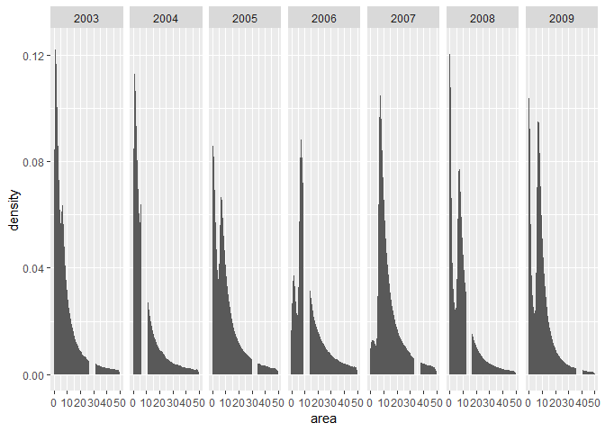
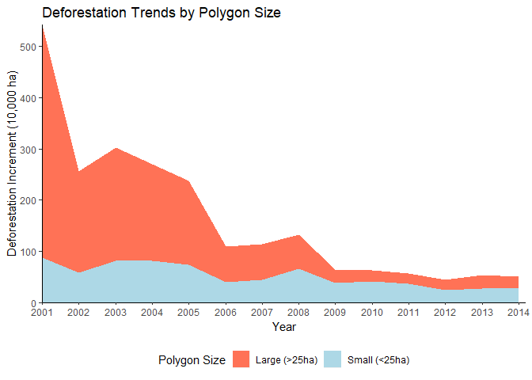

Anti-Deforestation Policies and Changes in the Clearings Pattern: Brazilian Amazon Case
================
Joao Pedro Vieira
November 25, 2018

### Loading Libraries

``` r
library(tidyverse)    # to manipulate data 
library(sf)           # to work with simple features data
library(XML)          # XML for HTML processing
library(utils)        # for 'unzip' function
```

### Functions (create separate file and source it)

``` r
UnzipMultipleFolders <- function(zip.dir,
                                 zip.pattern  = ".zip",
                                 unzip.subdir = T) {
  
    # UNZIPS FOLDERS IN GIVEN DIRECTORY & SUBDIRECTORIES AND DELETES COMPRESSED FOLDERS
    #
    # ARGS
    #   zip.dir:      parent directory containing zip files
    #   zip.pattern:  zipped file extension
    #   unzip.subdir: if TRUE, looks for 'zip.pattern' subdirs in 'zip.dir' (but does not find nested compressed dirs - 'while' loop in >
    #                      function addresses this)
    #
    # RETURN
    #   unzipped folders in equivalent directory structure
  
  
  
  
      # zipped folder identification 
      zip_list <- list.files(path       = zip.dir,
                             pattern    = zip.pattern,
                             recursive  = T,
                             full.names = T)
    
    
      # unzip procedure
      while (length(zip_list) > 0) {                          # 'while' to enable recursive unzip
        for (zip_folder in zip_list) {
          unzip_dir <- gsub(pattern     = zip.pattern,   # sets unzipped dir structure to mirror original zipped dir structure
                            replacement = "",
                            x           = zip_folder,
                            ignore.case = TRUE)
    
          unzip(zipfile   = zip_folder,                       # unzips folders
                overwrite = T,
                exdir     = unzip_dir)
      }
  
    map(zip_list, unlink)  # deletes zip files
  
    zip_list <- list.files(path       = zip.dir,       # 'zip.list' updated to check existence of remaining zip dirs in recently unzipped dirs
                           pattern    = zip.pattern,
                           recursive  = unzip.subdir,
                           full.names = T)
    }
  }


convert.sqm.to.ha   <- 0.0001

crs_SAD69longlatPre96BR <- "+proj=longlat +ellps=aust_SA +towgs84=-66.8700,4.3700,-38.5200,0.0,0.0,0.0,0.0 +no_defs"

crs_SIRGAS2000albers <- "+proj=aea +lat_1=-2 +lat_2=-22 +lat_0=-12 +lon_0=-54 +x_0=0 +y_0=0 +ellps=GRS80 +units=m +no_defs"
```

### Data Download

``` r
# web address setup
raw_data_url_index <- "http://www.dpi.inpe.br/prodesdigital/dadosn/2014/"


# directory setup
raw_data_dir <- "data_input" 

# download of 2015 shapefile data
  if (!dir.exists(paths = raw_data_dir)) { # check existence of "data_input" folder
    dir.create(path  = raw_data_dir)
    print(paste0("***NOTE: directory ", raw_data_dir, " created."))
  }
  
  
  if (length(list.files(raw_data_dir)) == 0) {
  
    html_matched  <- 
      htmlParse(raw_data_url_index) %>%           # parses html string (splits into components)
      getNodeSet("//a") %>%                       # finds nodes matching criterion "//a"
      map(xmlGetAttr, "href") %>% 
      grep(pattern = "*_shp.zip", value = T)      # selects elements matching "*_shp.zip" (returns landsat mosaic scenes)
  
    
    raw_data_url_zipfiles <- paste(raw_data_url_index, html_matched,
                                   sep = "")
    
    dest_path <- file.path(raw_data_dir, html_matched)
    
    map2(raw_data_url_zipfiles[1], dest_path[1], function(x,y) download.file(x,y))  # name determined in 'html_matched'
    
    
    UnzipMultipleFolders(zip.dir      = raw_data_dir,    # unzips downloaded data and deletes original compressed files
                         zip.pattern  = ".zip",
                         unzip.subdir = T)

}
```

Cleaning Data
-------------

``` r
clean_data_dir <- "data_clean"

if (!dir.exists(paths = clean_data_dir)) { # check existence of "data_clean" folder
  dir.create(path  = clean_data_dir)
  print(paste0("***NOTE: directory ", clean_data_dir, " created."))
}


if (!any(list.files(clean_data_dir) == "def_clean.Rdata")) { # check if def_clean.Rdata already exists locally

  folder_name  <- list.files(raw_data_dir) # create a list with all mosaic scene folders
  
  layer_name <- gsub(pattern = "_shp", replacement = "__pol", x = folder_name) # layer name is very similar to the folder name
  
  complete_path <- file.path(raw_data_dir, folder_name, "2014")
  
  mosaic_scene <- 
    map2(.x = complete_path, .y = layer_name, .f = st_read, quiet = T) 
    
  def_clean <-
    mosaic_scene %>% 
    map(st_set_crs, crs_SAD69longlatPre96BR) %>% # some scenes are missing the proj4string, so we set it based on documentation and existing proj4string 
    map(filter, mainclass == "DESFLORESTAMENTO") %>% # extracting deforestation data
    reduce(rbind) %>% # merging all sf objects into a single one
    
    st_transform(crs_SIRGAS2000albers) %>%  # projecting to "SIRGAS2000albers"
    mutate(area = unclass(st_area(def_clean)) * convert.sqm.to.ha) %>% # create area column and convert it to hectars
    mutate(polyg_id = paste(pathrow, linkcolumn, sep = "_")) %>% # create id column
    mutate(mainclass = as.character(mainclass)) %>% # transform column class from factor to character
    mutate(mainclass = replace(mainclass, mainclass == "DESFLORESTAMENTO", "DEFORESTATION")) %>% # translate mainclass
    rename(state_uf = uf, prodes_class = mainclass, prodes_year_increment = ano) %>%  # adjust columns name
    select(polyg_id, state_uf, prodes_class, prodes_year_increment, area) # keep column of interest
  
  rm(mosaic_scene)
  
  def_clean_df <- # create a version of the clean data with only data.frame information to have a light version of the data
    def_clean %>% 
    st_set_geometry(NULL)
  
  save(def_clean, file = file.path(clean_data_dir, "def_clean.Rdata"))  
  save(def_clean_df, file = file.path(clean_data_dir, "def_clean_df.Rdata"))  

}
```

Load clean data

``` r
load(file.path(clean_data_dir, "def_clean_df.Rdata"))

summary(def_clean_df)
```

    ##    polyg_id            state_uf      prodes_class      
    ##  Length:1508648     PA     :625821   Length:1508648    
    ##  Class :character   MT     :225828   Class :character  
    ##  Mode  :character   RO     :199107   Mode  :character  
    ##                     AM     :137924                     
    ##                     AC     :129956                     
    ##                     MA     :108158                     
    ##                     (Other): 81854                     
    ##  prodes_year_increment      area         
    ##  Min.   :1997          Min.   :    0.00  
    ##  1st Qu.:2001          1st Qu.:    2.88  
    ##  Median :2003          Median :    7.57  
    ##  Mean   :2004          Mean   :   49.27  
    ##  3rd Qu.:2008          3rd Qu.:   15.68  
    ##  Max.   :2014          Max.   :76838.06  
    ## 

``` r
def_clean_df %>% 
  filter(area < 50, prodes_year_increment > 2002, prodes_year_increment < 2010) %>% 
  mutate(prodes_year_increment = as.factor(prodes_year_increment)) %>% 
  ggplot(aes(x = area)) +
  geom_histogram( bins = 30, stat = "density") +
  facet_grid(. ~ prodes_year_increment)
```

    ## Warning: Ignoring unknown parameters: binwidth, bins, pad



``` r
def_clean_df %>% 
  group_by(prodes_year_increment) %>% 
  filter(prodes_year_increment >= 2001) %>% 
  mutate(size = ifelse(area < 25, "small", "large")) %>% 
  group_by(state_uf, prodes_year_increment, size) %>% 
  summarise(area_bysize = sum(area)) %>% 
  spread(key = size, value = area_bysize) %>% 
  replace_na(list(large = 0, small = 0)) %>% 
  rename(def_large = large, def_small = small) %>% 
  mutate(def_total = def_large + def_small) %>% 
  group_by(prodes_year_increment) %>% 
  summarise(sum_def_large = sum(def_large, na.rm = T)/10000, sum_def_small = sum(def_small, na.rm = T)/10000) %>% 
  gather(key = "size", value = "def", -prodes_year_increment) %>% 
  
ggplot(aes(x = prodes_year_increment, y = def, fill = size)) +
  geom_area() +
  scale_fill_manual(name = "Polygon Size", labels = c("Large (>25ha)", "Small (<25ha)"), values = c("coral1", "lightblue")) +
  ylab("Deforestation Increment (10,000 ha)") +
  xlab("Year") +
  ggtitle("Deforestation Trends by Polygon Size") +
  scale_x_continuous(breaks = c(2001:2014))
```


