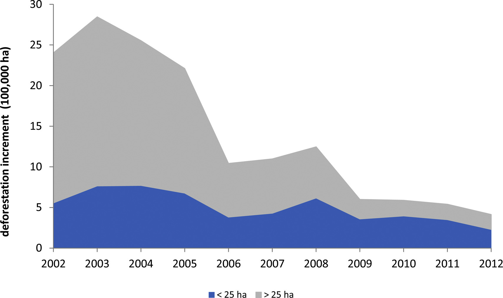
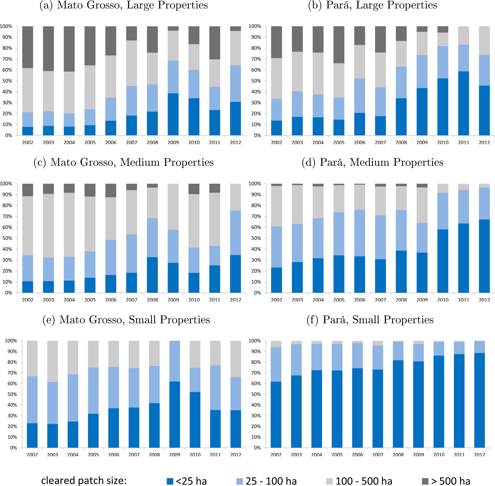
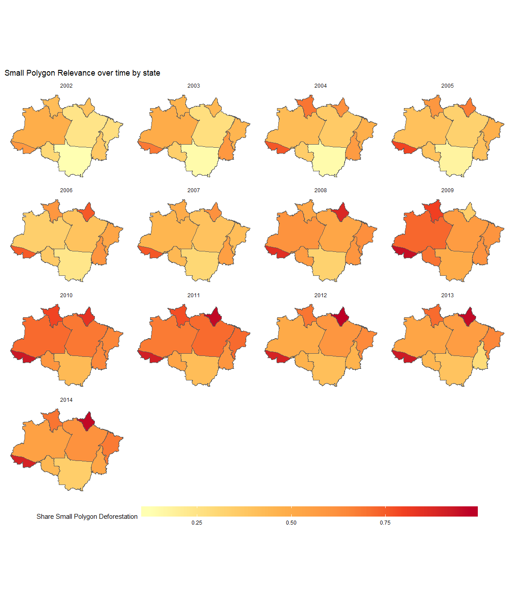

Anti-Deforestation Policies and Changes in the Clearings Pattern: Brazilian Amazon Case
================
Joao Pedro Vieira
December 9, 2018

Following [Rosa et al. (2012)](https://doi.org/10.1111/j.1523-1739.2012.01901.x) and [Assunção et al. (2017)](https://doi.org/10.1016/j.landusepol.2017.04.022), I am going to analyze how the deforestation pattern changed from 2002 through 2014 in the Legal Amazon. I will focus on three main elements: the trends of the deforestation by polygon size, the heterogeneity across state patterns, and the spatial distribution of the polygons over time. In 2004, the Brazilian Government implemented a satellite-based system that provides near-real-time alerts of deforestation (DETER) to inform law enforcement operations against illegal deforestation of tropical forest in the Amazon. However, this system can only detect clearings of a contiguous area bigger than 25 ha, so patches below this threshold are invisible to DETER and this information is public. Thus, the hypothesis is that DETER created an incentive to deforesters strategically adapt their behavior to deforest in small patches and thus impacted the distribution of the polygons size. Also, in 2008, there was a second turning point on conservation policies with the creation of a blacklist that allowed law enforcement to better target their efforts on municipalities with high rates of recent deforestation. Identifying a causal relationship between these policies changes and the deforestation trends is out of the scope of this report, what we are aiming to show here is a descriptive analysis of the deforestation pattern, considering time, state, and cleared patch size variation.

We will use the following spatial data (shapefiles):

**1. [Annual Deforestation Polygons \[2002-2014\]](http://www.dpi.inpe.br/prodesdigital/dadosn/2014)**

It contains the annual deforestation series of the Brazilian Amazon. Multiple shapefiles, one for each Landsat mosaic scene.

We use the 2014 file because we can recover all the previous year information from this mask. The shapefiles contains polygons of other land cover categories besides deforestation that won't be used in this analysis, like forest and hydrography.

CRS: LongLat (coordinate system), SAD69\_pre96\_BRonly (datum), not projected

**2. [Legal Amazon and State Boundaries](http://www.dpi.inpe.br/amb_data/Shapefiles/UF_AmLeg_LLwgs84.zip)**

Shapefile with the Legal Amazon Limits and the State Boundaries. Legal Amazon is geopoltical division of Brazil, includes the whole Brazilian Amazon Biome, part of the Cerrado and the Pantanal. More info about it: (<https://en.wikipedia.org/wiki/Legal_Amazon>)

CRS: LongLat (coordinate system), WGS84 (datum), not projected

### Loading Libraries

``` r
library(tidyverse)    # to manipulate data
library(sf)           # to work with simple features data
library(XML)          # XML for HTML processing
library(utils)        # for 'unzip' function
library(RColorBrewer) # for color palettes
library(gridExtra)    # for organizing multiple plots
library(stringr)      # for working with strings replacement
```

### Functions

The function used in this analysis are stored in an [R script repository](https://github.com/espm-157/final-project-individual-option-jpgmv1998/blob/master/assignment/functions.R)

``` r
source("functions.R")
```

### Data Download

The downloading and cleaning process are long so there are two options:

**1. Download the cleaned data directly from the project github** \[default\]

**2. Download data from original source and follow the whole process**

Both options are available on this script, but as default the first one will be used. The second one is entirely available just below this code chunk.

``` r
# 1. Download the cleaned data directly from the project github [default]
# To avoid Travis from timing out and to allow a faster way to run this code I saved the necessary data >
# after the downloading and cleaning and uploaded to [GitHUb](https://github.com/espm-157/final-project-individual-option-jpgmv1998/releases/tag/data) >
# but for reproducibility purporses I kept all the necessary code here but their evaluation >
# are conditioned to the non-existence of the data_clean folder which is created in this chunk. >
# If you want to reproduce from scratch it is necessary to toggle off this chunk.
if (!dir.exists(paths = clean_data_dir)) {
  # set url
  clean_data_url_index <-
  "https://github.com/espm-157/final-project-individual-option-jpgmv1998/releases/download/data/data_clean.zip"
  # set folder name
  folder_name <- "data_clean.zip"
  # download clean data
  download.file(url = clean_data_url_index, destfile = folder_name)
  # unzips folder
  unzip(zipfile = folder_name,
        overwrite = T)
  # remove zip file
  unlink(folder_name)
}
```

#### Deforestation

``` r
# 2. Download data from original source and follow the whole process

if (!dir.exists(paths = clean_data_dir)) {
  # web address setup
  raw_data_url_index <- "http://www.dpi.inpe.br/prodesdigital/dadosn/2014/"
  # directory setup
  raw_data_dir <- "data_input"
  # download of 2014 shapefile data
  # check existence of "data_input" folder
  if (!dir.exists(paths = raw_data_dir)) {
    dir.create(path  = raw_data_dir)
    print(paste0("***NOTE: directory ", raw_data_dir, " created."))
  }
  if (length(list.files(raw_data_dir)) == 0) {
    html_matched <- htmlParse(raw_data_url_index) %>%  # parses html string (splits into components)
    getNodeSet("//a") %>%  # finds nodes matching criterion "//a"
    map(xmlGetAttr, "href") %>%
    grep(pattern = "*_shp.zip", value = T)  # selects elements matching "*_shp.zip" (returns landsat mosaic scenes)
    raw_data_url_zipfiles <- paste(raw_data_url_index, html_matched,
                                   sep = "")
    dest_path <- file.path(raw_data_dir, html_matched)
    map2(raw_data_url_zipfiles, dest_path, function(x, y) download.file(x, y)) # name determined in 'html_matched'
    unzip_multiple_folders(zip.dir      = raw_data_dir,  # unzips downloaded data and deletes original compressed files
                         zip.pattern  = ".zip",
                         unzip.subdir = T)
  }
}
```

#### Legal Aamazon - State Boundaries

``` r
# 2. Download data from original source and follow the whole process

if (!dir.exists(paths = clean_data_dir)) {
  # only download data if there is not a local copy
  if (!file.exists(file.path(raw_data_dir, "UF_AmLeg_LLwgs84"))) {
    raw_data_url_index_2 <- "http://www.dpi.inpe.br/amb_data/Shapefiles/UF_AmLeg_LLwgs84.zip" # set url
    download.file(url = raw_data_url_index_2, destfile = "data_input/UF_AmLeg_LLwgs84.zip") # download the shapefile
    unzip_multiple_folders(zip.dir      = raw_data_dir,    # unzips downloaded data and deletes original compressed files
                         zip.pattern  = ".zip",
                         unzip.subdir = T)
  }
}
```

### Data Cleaning

#### Deforestation

``` r
if (!dir.exists(paths = clean_data_dir)) {
  # check existence of "data_clean" folder
  if (!dir.exists(paths = clean_data_dir)) {
    dir.create(path  = clean_data_dir)
    print(paste0("***NOTE: directory ", clean_data_dir, " created."))
  }
  # check if def_clean.Rdata already exists locally
  if (!any(list.files(clean_data_dir) == "def_clean.Rdata")) {
    folder_name  <- list.files(raw_data_dir, pattern = "_shp") # create a list with all mosaic scene folders
    layer_name <- str_replace(pattern = "_shp", replacement = "__pol", string = folder_name) # layer name is very similar to the folder name
    complete_path <- file.path(raw_data_dir, folder_name, "2014")
    mosaic_scene <-
    map2(.x = complete_path, .y = layer_name, .f = st_read, quiet = T)
    def_clean <-
    mosaic_scene %>%
    map(st_set_crs, crs_sad69longlatpre96br) %>% # some scenes are missing the proj4string, so we set it based on documentation and existing proj4string
    map(filter, mainclass == "DESFLORESTAMENTO") %>% # extracting deforestation data
    reduce(rbind) %>% # merging all sf objects into a single one
    st_transform(crs_sirgas2000albers) %>%  # projecting to "SIRGAS2000albers"
    mutate(area = unclass(st_area(.)) * convert_sqm_to_ha) %>% # create area column and convert it to hectars
    mutate(polyg_id = paste(pathrow, linkcolumn, sep = "_")) %>% # create id column
    mutate(mainclass = as.character(mainclass)) %>% # transform column class from factor to character
    mutate(mainclass = replace(mainclass, mainclass == "DESFLORESTAMENTO", "DEFORESTATION")) %>% # translate mainclass
    rename(state_uf = uf, prodes_class = mainclass, prodes_year_increment = ano) %>%  # adjust columns name
    select(polyg_id, state_uf, prodes_class, prodes_year_increment, area) # keep column of interest

    rm(mosaic_scene)
    def_clean_df <- # create a version of the clean data with only data.frame information to have a light version of the data
      def_clean %>%
      st_set_geometry(NULL)

    save(def_clean, file = file.path(clean_data_dir, "def_clean.Rdata"))
    save(def_clean_df, file = file.path(clean_data_dir, "def_clean_df.Rdata"))
  }
}
```

#### Legal Aamazon - State Boundaries

``` r
# 2. Download data from original source and follow the whole process

if (!dir.exists(paths = clean_data_dir)) {
  # check if def_clean.Rdata already exists locally
  if (!any(list.files(clean_data_dir) == "la_clean.Rdata")) {

    folder_name  <- list.files(raw_data_dir, pattern = "AmLeg") # create a list with the Legal Amazon folder

    subfolder_name <- str_replace(pattern = "UF", replacement = "UFS", string = folder_name) # subfolder name is very similar to the folder name

    layer_name <-     # layer name is very similar to the subfolder name
      str_to_upper(subfolder_name) %>%
      str_replace(pattern = "AMLEG", replacement = "AMZLEG")

    complete_path <- file.path(raw_data_dir, folder_name, subfolder_name)

    la_clean <-
      st_read(dsn = complete_path, layer = layer_name, quiet = T) %>%
      st_transform(crs_sirgas2000albers) %>%
      mutate(area = unclass(st_area(.)) * convert_sqm_to_ha) %>% # create area column and convert it to hectars
      rename(state_uf = NOME) %>%  # adjust columns name
      select(state_uf, area, geometry) %>%
      mutate(state_uf = as.character(state_uf)) %>%
      mutate(state_uf = if_else(state_uf == "AMAPÁ", "AP", state_uf)) %>%
      mutate(state_uf = if_else(state_uf == "MATO GROSSO", "MT", state_uf)) %>%
      mutate(state_uf = if_else(state_uf == "RORAIMA", "RR", state_uf)) %>%
      mutate(state_uf = str_sub(str_to_upper(state_uf), start = 1, end = 2))  # make a uniform pattern

    save(la_clean, file = file.path(clean_data_dir, "la_clean.Rdata"))

  }
}
```

### Load clean data

``` r
load(file.path(clean_data_dir, "def_clean_df.Rdata")) # same as def_clean but without the geometry, just dataframe

load(file.path(clean_data_dir, "def_clean.Rdata"))

load(file.path(clean_data_dir, "la_clean.Rdata"))

gc(verbose = F) # free memory
```

    ##             used  (Mb) gc trigger   (Mb)  max used  (Mb)
    ## Ncells  11755976 627.9   17524161  935.9  11769783 628.6
    ## Vcells 130792494 997.9  185747550 1417.2 130814648 998.1

### 1. Deforestation Trends by size of cleared patch

First of all, we are going to explore the evolution of the deforestation across the period of interest (2002-2014), splitting the deforestation increment into two categories: small polygons (contiguous area smaller than 25 hectars) and large polygons (contiguous area greater than 25 hectars). This analysis is inspired by:

**Fig. 1 - Amazon deforestation by the size of cleared forest patch, 2002–2012 - (Assunção et al., 2017)** 

``` r
def_clean_df %>%
  group_by(prodes_year_increment) %>%
  filter(prodes_year_increment >= 2002) %>%
  mutate(size = if_else(area < 25, "small", "large")) %>%
  group_by(state_uf, prodes_year_increment, size) %>%
  summarise(area_bysize = sum(area)) %>%
  spread(key = size, value = area_bysize) %>%
  replace_na(list(large = 0, small = 0)) %>%
  rename(def_large = large, def_small = small) %>%
  mutate(def_total = def_large + def_small) %>%
  group_by(prodes_year_increment) %>%
  summarise(sum_def_large = sum(def_large, na.rm = T) / 100000, sum_def_small = sum(def_small, na.rm = T) / 100000) %>%
  gather(key = "size", value = "def", -prodes_year_increment) %>%

ggplot(aes(x = prodes_year_increment, y = def, fill = size)) +
  geom_area() +
  scale_fill_manual(name = "Polygon Size", labels = c("Large (>25ha)", "Small (<25ha)"), values = c("coral1", "lightblue")) +
  labs(x = "Year",
       y = "Deforestation Increment (100,000 ha)",
       title = "Deforestation Trends by Polygon Size",
       subtitle = "Inspired by Fig. 1 (Assunção et al., 2017) ",
       caption = "Notes: Reproducing Fig.1 from Assunção et al. (2017) expanding time period to include 2 more years.\n The figure illustrates annual Brazilian Amazon deforestation increment decomposed by size of cleared forest patch") +
  scale_x_continuous(breaks = c(2002:2014), expand = c(0, 0), limits = c(2002, 2014.2)) +
  scale_y_continuous(expand = c(0, 0)) +
  theme(panel.grid.major = element_blank(), panel.grid.minor = element_blank(),
panel.background = element_blank(), axis.line = element_line(colour = "black"), legend.position = "bottom")
```


``` r
gc(verbose = F) # free memory
```

    ##             used   (Mb) gc trigger   (Mb)  max used   (Mb)
    ## Ncells  11905131  635.9   17524161  935.9  13575838  725.1
    ## Vcells 131096195 1000.2  222977060 1701.2 152201413 1161.3

As we can see in both graphs above, there war sharp falls in the deforestation after both anti-deforestation policies turning points (2004 and 2008), however as pointed out by (Assunção et al. (2017)) it seems to have impacted more the large polygons, increasing the relevance of small polygons. Linking this descriptive evidence with the fact that the satellite-based monitoring system can only detect the large cleared patches and that this limitation was public information, there might be a strategic behavior adaptation by deforesters explaining it. Our plot is a reproduction of (Assunção et al. (2017)) graph, but expanding to include two more years. This inclusion doesn't change the overall interpretation, only shows that the levels are somewhat constant, with a small increase similar for both groups.

For completeness we also reproduce:

**Fig. 2 - (a) Percentage and (b) area of deforested patches of different sizes in the Brazilian Amazon from 2002 through 2009. - (Rosa et al., 2012)** <br> 

``` r
panel_a <-
def_clean_df %>%
group_by(prodes_year_increment) %>%
filter(prodes_year_increment >= 2002) %>%
mutate(size = if_else(area < 25, "<25 ha", as.character(NA))) %>%
mutate(size = if_else(area >= 25 & area < 100, "25-100 ha", size)) %>%
mutate(size = if_else(area >= 100 & area < 500, "100-500 ha", size)) %>%
mutate(size = if_else(area >= 500, "> 500 ha", size)) %>%
group_by(state_uf, prodes_year_increment, size) %>%
summarise(area_bysize = sum(area)) %>%
ungroup() %>%
mutate(size = factor(size, levels = c("> 500 ha", "100-500 ha", "25-100 ha", "<25 ha"))) %>%
mutate(prodes_year_increment = as.factor(prodes_year_increment)) %>%

ggplot(aes(x = prodes_year_increment, y = area_bysize)) +
  geom_bar(aes(fill = size), stat = "identity", position = "fill") +
  scale_fill_manual(name = "Polygon Size", values = brewer.pal(n = 6, name = "Greys")[2:6]) +
  labs(x = "Year",
       y = "Deforestation Share",
       title = "Deforestation Trends by Polygon Size",
       subtitle = "Inspired by Figure 2 - (a) - Rosa et al. (2012)",
       caption = "Notes: Reproducing Fig.2 (a) from Rosa et al. (2012) expanding time period to include 5 more years and different patches.\n The figure illustrates the share of deforested patches of different sizes in the Brazilian Amazon from 2002 through 2014.") +
  scale_x_discrete(breaks = c(2002:2014), expand = c(0, 0)) +
  scale_y_continuous(expand = c(0, 0)) +
  theme(panel.grid.major = element_blank(), panel.grid.minor = element_blank(),
panel.background = element_blank(), axis.line = element_line(colour = "black"), legend.position = "bottom")

panel_b <-
def_clean_df %>%
group_by(prodes_year_increment) %>%
filter(prodes_year_increment >= 2002) %>%
mutate(size = if_else(area < 25, "<25 ha", as.character(NA))) %>%
mutate(size = if_else(area >= 25 & area < 100, "25-100 ha", size)) %>%
mutate(size = if_else(area >= 100 & area < 500, "100-500 ha", size)) %>%
mutate(size = if_else(area >= 500, "> 500 ha", size)) %>%
group_by(state_uf, prodes_year_increment, size) %>%
summarise(area_bysize = sum(area)) %>%
ungroup() %>%
mutate(area_bysize = area_bysize / 10000) %>%
mutate(size = factor(size, levels = c("> 500 ha", "100-500 ha", "25-100 ha", "<25 ha"))) %>%
mutate(prodes_year_increment = as.factor(prodes_year_increment)) %>%

ggplot(aes(x = prodes_year_increment, y = area_bysize, fill = size)) +
  geom_bar(position = "stack", stat = "identity") +
  scale_fill_manual(name = "Polygon Size", values = brewer.pal(n = 6, name = "Greys")[2:6]) +
  labs(x = "Year",
       y = "Deforestation rate (10,000 ha/yr)",
       title = "Deforestation Trends by Polygon Size",
       subtitle = "Inspired by Figure 2 - (b) - Rosa et al. (2012)",
       caption = "Notes: Reproducing Fig.2 (b) from Rosa et al. (2012) expanding time period to include 5 more years and different patches.\n The figure illustrates area of deforested patches of different sizes in the Brazilian Amazon from 2002 through 2014.") +
  scale_x_discrete(breaks = c(2002:2014)) +
  scale_y_continuous(expand = c(0, 0)) +
  theme(panel.grid.major = element_blank(), panel.grid.minor = element_blank(),
panel.background = element_blank(), axis.line = element_line(colour = "black"), legend.position = "bottom")

grid.arrange(panel_a, panel_b, ncol = 1)
```


``` r
rm(panel_a, panel_b) # remove unnecessary objects
gc(verbose = F) # free memory
```

    ##             used   (Mb) gc trigger   (Mb)  max used   (Mb)
    ## Ncells  11990292  640.4   17524161  935.9  15222285  813.0
    ## Vcells 131265601 1001.5  222977060 1701.2 222970169 1701.2

These plots allows us to explore the trends for more categories and also look at the shares and not only the nominal increment. In our reproduction we expand it to include 5 more years and use the size intervals based on (Assunção et al. (2017)) to separate the policy relevant category of (&lt;25ha). Looking at the shares we can see a sistematic increase in the share of small polygons (&lt;25 ha) until 2010, after that there is a decrease but remaining as the majority proportion. The share is calculated as the ratio of the deforestation generated by the polygon size category and the total deforestation, for each year.

### 2. State Heterogeneity

Secondly, we want to explore the variation of these trends acrosse the states, to check for the presence of outliers and heterogeneity. As argued by (Assunção et al. (2017)), regional heterogeneities require the policies to be tailored to maximize its efficiency. Inspired by:

**Fig. 3 - Deforestation inside registered properties by property and cleared patch size, 2002–2012. - (Assunção et al., 2017)**

In this case, we cannot reproduce the content of Fig. 3 entirely because we do not have assess to registered properties information, on the other hand, we expand their analysis to cover all the Legal Amazon States instead of only two. In practice, we cannot link the polygon size with the type of agent (small, medium or large properties) but we can have a better notion of the heterogeneity of the deforestation by size.

#### Simple Plot of State Boundaries and UFs

For starters we do a exploratory plot, to show the Legal Amazon region and its states.

``` r
cbind(la_clean, st_coordinates(st_centroid(la_clean))) %>%
  ggplot() +
  geom_sf(fill = NA) +
  geom_text(aes(X, Y, label = state_uf), size = 5) +
  labs(x = "Lon", y = "Lat", title = "Map of Legal Amazon - State Boundaries") +
  theme_bw()
```


``` r
gc(verbose = F) # free memory
```

    ##             used   (Mb) gc trigger   (Mb)  max used   (Mb)
    ## Ncells  11946461  638.1   17524161  935.9  15222285  813.0
    ## Vcells 131256425 1001.5  222977060 1701.2 222970169 1701.2

#### Plot of proportion of polygons by cleared patch through time by state.

For a complete notion of what's happening in each state we plot the proportion of the 4 sizes categories for each year.

``` r
def_clean_df %>%
  group_by(prodes_year_increment) %>%
  filter(prodes_year_increment >= 2002) %>%
  mutate(size = if_else(area < 25, "<25 ha", as.character(NA))) %>%
  mutate(size = if_else(area >= 25 & area < 100, "25-100 ha", size)) %>%
  mutate(size = if_else(area >= 100 & area < 500, "100-500 ha", size)) %>%
  mutate(size = if_else(area >= 500, "> 500 ha", size)) %>%
  group_by(state_uf, prodes_year_increment, size) %>%
  summarise(area_bysize = sum(area)) %>%
  ungroup() %>%
  mutate(prodes_year_increment = as.factor(prodes_year_increment)) %>%
  mutate(size = factor(size, levels = c("> 500 ha", "100-500 ha", "25-100 ha", "<25 ha"))) %>%

ggplot(aes(x = prodes_year_increment, y = area_bysize)) +
  geom_bar(aes(fill = size), stat = "identity", position = "fill") +
  scale_fill_manual(name = "Polygon Size", values = brewer.pal(n = 6, name = "Greys")[2:6]) +
  ylab("Share Polygon Size") +
  xlab("Year") +
  ggtitle("Polygons Trends by State and Cleared Patch Size") +
  scale_x_discrete(breaks = c(2002:2014), expand = c(0, 0)) +
  scale_y_continuous(expand = c(0, 0)) +
  facet_wrap(. ~ state_uf, ncol = 2, scales = "free") +
  theme(panel.grid.major = element_blank(), panel.grid.minor = element_blank(),
panel.background = element_blank(), axis.line = element_line(colour = "black"), legend.position = "bottom", strip.background = element_rect(fill = NA))
```


``` r
gc(verbose = F) # free memory
```

    ##             used   (Mb) gc trigger   (Mb)  max used   (Mb)
    ## Ncells  12071836  644.8   17524161  935.9  17524161  935.9
    ## Vcells 131421381 1002.7  222977060 1701.2 222970169 1701.2

We see that there are states such as AC and AP with almost all the deforestation coming from small polygons, contrasting with states like MT were larger polygons are more relevant. As expected for most of the states, small polygons increased their relevance becoming the majority, yet the presence of other patterns supports the idea of tailored policy to adjust the polcies accordingly to the local pattern instead of treating the whole region as unique and uniform.

#### Maps of the proportion of small polygons across years

To complement the last plot we also focus only on the share of small polygons and the share of the State Deforested area to have a better visualization of the state-differences in each year.

``` r
def_clean_df %>%
  group_by(prodes_year_increment) %>%
  filter(prodes_year_increment >= 2002) %>%
  mutate(size = if_else(area < 25, "small", "large")) %>%
  group_by(state_uf, prodes_year_increment, size) %>%
  summarise(area_bysize = sum(area)) %>%
  spread(key = size, value = area_bysize) %>%
  replace_na(list(large = 0, small = 0)) %>%
  rename(def_large = large, def_small = small) %>%
  mutate(def_total = def_large + def_small) %>%
  mutate(share_def_small = def_small / def_total) %>%
  right_join(la_clean) %>%

ggplot() +

  geom_sf(aes(fill = share_def_small)) +
  facet_wrap(. ~ prodes_year_increment, ncol = 4) +
  scale_fill_distiller(type = "seq", palette = "YlOrRd", direction = 1, name = "Share Small Polygon Deforestation") +

  theme(panel.grid.major = element_line(colour = "White"),
        panel.grid.minor = element_line(colour = "white"),
        panel.background = element_blank(),
        strip.background = element_rect(fill = NA),
        axis.line = element_blank(), axis.ticks = element_blank(),
        axis.title = element_blank(), axis.text = element_blank(),
        legend.position = "bottom", legend.key.width = unit(4, "cm"))
```



``` r
gc(verbose = F) # free memory
```

    ##             used   (Mb) gc trigger   (Mb)  max used   (Mb)
    ## Ncells  12005318  641.2   17524161  935.9  17524161  935.9
    ## Vcells 132453943 1010.6  222977060 1701.2 222970169 1701.2

#### Maps of the ratio of total deforestation and state area across years

``` r
def_clean_df %>%
  group_by(prodes_year_increment) %>%
  filter(prodes_year_increment >= 2002) %>%
  group_by(state_uf, prodes_year_increment) %>%
  summarise(area_def = sum(area)) %>%
  replace_na(area_def = 0) %>%
  right_join(la_clean) %>%
  mutate(share_def = area_def / area) %>%

ggplot() +

  geom_sf(aes(fill = share_def)) +
  facet_wrap(. ~ prodes_year_increment, ncol = 4) +
  scale_fill_distiller(type = "seq", palette = "YlOrRd", direction = 1, name = "Share of State Deforested Area") +

  theme(panel.grid.major = element_line(colour = "White"),
        panel.grid.minor = element_line(colour = "white"),
        panel.background = element_blank(),
        strip.background = element_rect(fill = NA),
        axis.line = element_blank(), axis.ticks = element_blank(),
        axis.title = element_blank(), axis.text = element_blank(),
        legend.position = "bottom", legend.key.width = unit(4, "cm"))
```


``` r
gc(verbose = F) # free memory
```

    ##             used   (Mb) gc trigger   (Mb)  max used   (Mb)
    ## Ncells  12005261  641.2   17524161  935.9  17524161  935.9
    ## Vcells 132452991 1010.6  222977060 1701.2 222970169 1701.2

``` r
rm(def_clean_df)
```

From these visualizations we can conclude that there are persistent differences across the states for any given year for both measures, even though there is a common trends of less total deforestation and more presence of small cleared patches.

### 3. Spatial Distribution of deforestation by cleared patch size across time (2002-2014) - create function to just change the start and end year

Finally, we want to take advantage that we have spatial data at the polygon level to observe the spatial distribution of the deforestation by polygon size in different time periods, first a period of fast increase in deforestation rate (2002-2004), then a period of fast decrease (2005-2009) and lastly a period of relative stabilization (2010-2014). Inspired by:

**Fig. 4 - Distribution of deforested patches of different sizes in the Brazilian Amazon for periods of (a) rapidly increasing deforestation (2002 through 2004) and (b) rapidly decreasing deforestation (2005 through 2009).- (Rosa et al., 2012)**


``` r
if (file.exists("final-project_files/figure-markdown_github/polyg_distrib-1.png")) {

  knitr::include_graphics("final-project_files/figure-markdown_github/polyg_distrib-1.png")

} else {

   map_1 <-
    def_clean %>%
    filter(prodes_year_increment >= 2002 & prodes_year_increment <= 2004) %>%
    mutate(size = if_else(area < 25, "<25 ha", as.character(NA))) %>%
    mutate(size = if_else(area >= 25 & area < 100, "25-100 ha", size)) %>%
    mutate(size = if_else(area >= 100 & area < 500, "100-500 ha", size)) %>%
    mutate(size = if_else(area >= 500, "> 500 ha", size)) %>%
    group_by(state_uf, size) %>%
    st_union(by_feature = T) %>%
    st_simplify() %>%
    ungroup() %>%
    mutate(size = factor(size, levels = c("> 500 ha", "100-500 ha", "25-100 ha", "<25 ha"))) %>%
    ggplot() +
    geom_sf(aes(col = size, fill = size), size = 1.05) +
    geom_sf(data = la_clean, fill = NA) +
    ggtitle(paste0("Distribution of deforested patches by size (", 2002, "-", 2004, ")")) +
    theme(panel.grid.major = element_line(colour = "White"),
          panel.grid.minor = element_line(colour = "white"),
          panel.background = element_blank(),
          strip.background = element_rect(fill = NA),
          axis.line = element_blank(), axis.ticks = element_blank(),
          axis.title = element_blank(), axis.text = element_blank(),
          legend.position = "bottom")

   map_2 <-
    def_clean %>%
    filter(prodes_year_increment >= 2005 & prodes_year_increment <= 2009) %>%
    mutate(size = if_else(area < 25, "<25 ha", as.character(NA))) %>%
    mutate(size = if_else(area >= 25 & area < 100, "25-100 ha", size)) %>%
    mutate(size = if_else(area >= 100 & area < 500, "100-500 ha", size)) %>%
    mutate(size = if_else(area >= 500, "> 500 ha", size)) %>%
    group_by(state_uf, size) %>%
    st_union(by_feature = T) %>%
    st_simplify() %>%
    ungroup() %>%
    mutate(size = factor(size, levels = c("> 500 ha", "100-500 ha", "25-100 ha", "<25 ha"))) %>%
    ggplot() +
    geom_sf(aes(col = size, fill = size), size = 1.05) +
    geom_sf(data = la_clean, fill = NA) +
    ggtitle(paste0("Distribution of deforested patches by size (", 2005, "-", 2009, ")")) +
    theme(panel.grid.major = element_line(colour = "White"),
          panel.grid.minor = element_line(colour = "white"),
          panel.background = element_blank(),
          strip.background = element_rect(fill = NA),
          axis.line = element_blank(), axis.ticks = element_blank(),
          axis.title = element_blank(), axis.text = element_blank(),
          legend.position = "bottom")

   map_3 <-
    def_clean %>%
    filter(prodes_year_increment >= 2010 & prodes_year_increment <= 2014) %>%
    mutate(size = if_else(area < 25, "<25 ha", as.character(NA))) %>%
    mutate(size = if_else(area >= 25 & area < 100, "25-100 ha", size)) %>%
    mutate(size = if_else(area >= 100 & area < 500, "100-500 ha", size)) %>%
    mutate(size = if_else(area >= 500, "> 500 ha", size)) %>%
    group_by(state_uf, size) %>%
    st_union(by_feature = T) %>%
    st_simplify() %>%
    ungroup() %>%
    mutate(size = factor(size, levels = c("> 500 ha", "100-500 ha", "25-100 ha", "<25 ha"))) %>%
    ggplot() +
    geom_sf(aes(col = size, fill = size), size = 1.05) +
    geom_sf(data = la_clean, fill = NA) +
    ggtitle(paste0("Distribution of deforested patches by size (", 2010, "-", 2014, ")")) +
    theme(panel.grid.major = element_line(colour = "White"),
          panel.grid.minor = element_line(colour = "white"),
          panel.background = element_blank(),
          strip.background = element_rect(fill = NA),
          axis.line = element_blank(), axis.ticks = element_blank(),
          axis.title = element_blank(), axis.text = element_blank(),
          legend.position = "bottom")

  grid.arrange(map_1, map_2, map_3, ncol = 1)

}
```


``` r
rm(def_clean, la_clean)
gc(verbose = F) # free memory
```

    ##           used (Mb) gc trigger   (Mb)  max used   (Mb)
    ## Ncells 1164576 62.2   14019328  748.8  17524161  935.9
    ## Vcells 3061492 23.4  178381648 1361.0 222970169 1701.2

### Conclusion

### References

[Assunção, Juliano, Clarissa Gandour, Pedro Pessoa, and Romero Rocha. "Property-level assessment of change in forest clearing patterns: The need for tailoring policy in the Amazon." Land Use Policy 66 (2017): 18-27.](https://doi.org/10.1016/j.landusepol.2017.04.022)

[Rosa, Isabel MD, Carlos Souza Jr, and Robert M. Ewers. "Changes in size of deforested patches in the Brazilian Amazon." Conservation Biology 26, no. 5 (2012): 932-937.](https://doi.org/10.1111/j.1523-1739.2012.01901.x)
