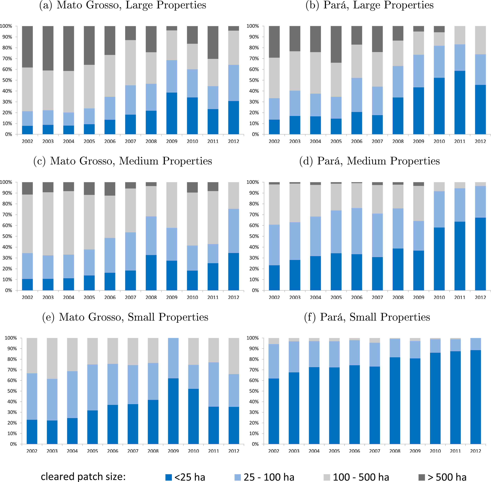
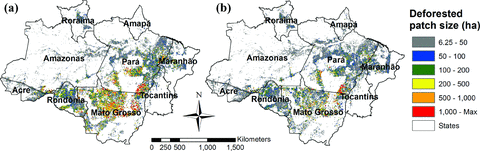
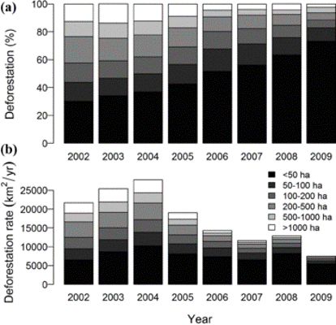

## Final project proposal

### Joao Pedro Vieira (individual project)

### **Anti-Deforestation Policies and Changes in the Clearings Pattern: Brazilian Amazon Case**

### Description

  Following Rosa et al. (2012) and Assunção et al. (2017), I am going to analyze how the deforestation pattern changed through 2000-2014, comparing two primary type of clearings: small-scale (less than 25 ha) and large-scale (more than 25 ha). In 2004, the Brazilian Government implemented a satellite-based system that provides near-real-time alerts of deforestation (DETER) to inform law enforcement operations against illegal deforestation of tropical forest in the Amazon. However, this system can only detect clearings of a contiguous area bigger than 25 ha, so patches below this threshold are invisible to DETER and this information is public. Thus, the hypothesis is that DETER created an incentive to deforesters strategically adapt their behavior to deforest in small patches.

### Data

1. Deforestation polygons - Source: INPE (<http://www.dpi.inpe.br/prodesdigital/dadosn/2014>)

It contains the annual deforestation series of the Brazilian Amazon. Multiple shapefiles, one for each Landsat mosaic scene in each year.

We use the 2014 file because we can recover all the previous year information from this mask.
The shapefiles contains polygons of other land cover categories besides deforestation, like forest and hydrography, that won't be used in this analysis.

Relevant information: year of deforestation, spatial location and polygon category.  

CRS: LongLat (coordinate system), SAD69_pre96_BRonly (datum), not projected 

2. Brazilian Municipalities Boundaries (2015) - Source: IBGE (<ftp://geoftp.ibge.gov.br/organizacao_do_territorio/malhas_territoriais/malhas_municipais/municipio_2015/Brasil/BR/br_municipios.zip>)

Contains a shapefile with municipal perimeter for full Brazilian extension with 2015 as the year of reference (most recent).

CRS: SIRGAS 2000 longlat (not projected)

3. Legal Amazon (*Amazonia Legal*) Perimeter Shapefile - Source: INPE (<http://www.dpi.inpe.br/amb_data/Shapefiles/UF_AmLeg_LLwgs84.zip>)

Shapefile with the Legal Amazon Limits. Legal Amazon is geopoltical division of Brazil, includes the whole Brazilian Amazon Biome, part of the Cerrado and the Pantanal. More info about it: (<https://en.wikipedia.org/wiki/Legal_Amazon>)

### Inspirational Graphics

 

**Fig. 1 - Amazon deforestation by the size of cleared forest patch, 2002–2012 - (Assunção et al., 2017)**

 
 

**Fig. 2 - Deforestation inside registered properties by property and cleared patch size, 2002–2012. - (Assunção et al., 2017)**

 
 

**Fig. 3 - Distribution of deforested patches of different sizes in the Brazilian Amazon for periods of (a) rapidly increasing deforestation (2002 through 2004) and (b) rapidly decreasing deforestation (2005 through 2009).- (Rosa et al., 2012)**

 
 

**Fig. 4 - (a) Percentage and (b) area of deforested patches of different sizes in the Brazilian Amazon from 2002 through 2009. - (Rosa et al., 2012)**
 

  

### Questions

1) Analyze Deforestation Trends in the Brazilian Amazon by the size of cleared patch (2001-2014) - inspired by figures 1 and 4.

2) Analyze Deforestation Trends in the Brazilian Amazon by the size of cleared patch and State (2001-2014) - inspired by figures 2 and 3.

3) Analyze discontinuities in deforestation outcomes (y-axis) with a small bandwidth around the 25 ha cutoff, using the polygon size as the running variable (x-axis) for a period before and a period after the implementation of DETER.

### Project questions will illustrate all of the following tasks:

- Some form of data access / reading into R
- Data tidying preparation
- Initial data visualization
- Use of GitHub
- Reproducible execution with use of Travis
- RMarkdown writeup, with final submission as a nicely formatted PDF document that includes code and results.
- Overall clean and clear presentation of repository, code, and explanations.

### and probably include the following skills (in bold):

- **Use of at least 5 `dplyr` verbs / functions**
- **Writing / working with custom R functions**
- Creating an R package for functions used in the analysis
- Interaction with an API
- **Use of regular expressions**
- Use of an external relational database
- Preparing processed data for archiving / publication
- Parsing extensible data formats (JSON, XML)
- **Use of spatial vector data (`sf` package) and visualization of spatial data**
- Creation of an R package

### References

Assunção, Juliano, Clarissa Gandour, Pedro Pessoa, and Romero Rocha. "Property-level assessment of change in forest clearing patterns: The need for tailoring policy in the Amazon." Land Use Policy 66 (2017): 18-27.(<https://doi.org/10.1016/j.landusepol.2017.04.022>)

Rosa, Isabel MD, Carlos Souza Jr, and Robert M. Ewers. "Changes in size of deforested patches in the Brazilian Amazon." Conservation Biology 26, no. 5 (2012): 932-937.(<https://doi.org/10.1111/j.1523-1739.2012.01901.x>)

